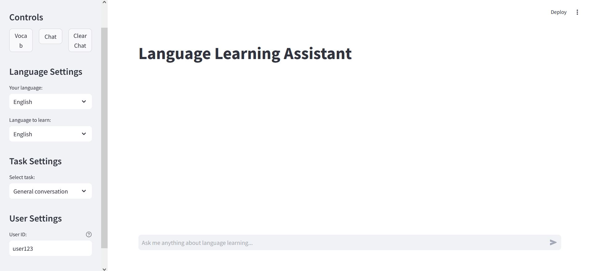
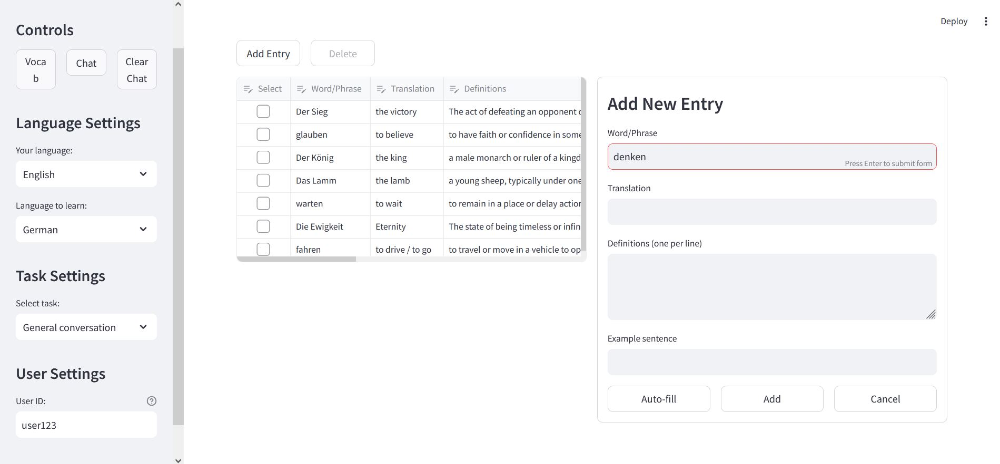
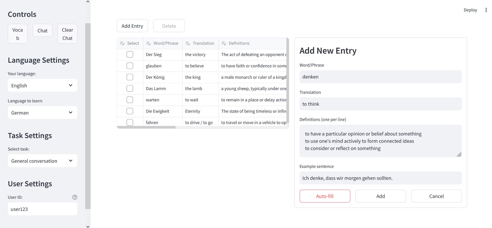

# lang-assist-app
LLM backed language assistant for language learning.
## Overview
Lang-assist-app is an AI-powered language learning assistant that provides interactive language learning features through Large Language Models (LLMs). The application offers various tools to help users learn and practice their target language effectively.

## Features

### 1. Text Analysis
- Detailed sentence-by-sentence breakdown of texts
- Word and phrase level analysis including:
  - Translations
  - Multiple definitions
  - Usage examples
  - Grammar explanations
- Comprehensive grammar analysis for each sentence

### 2. Vocabulary Tools
- Vocabulary autofill with detailed word information
  
  
- Flashcard generation for vocabulary practice
- Random word generation for vocabulary expansion
- Fill-in-the-blank exercises
   

### 3. Interactive Learning
- Customizable interface language
- Support for multiple target languages
- Natural conversation capabilities with AI language teacher

## Setup

1. Clone the repository
2. Set up your environment variables:
   - `OPENAI_API_KEY`: Your OpenAI API key
3. Install dependencies (requirements.txt file)
4. Run the application

## Usage

The application provides several prompt templates for different learning activities:

1. **Default Mode**: General language learning assistance and conversations
2. **Text Analysis**: Deep dive into text comprehension and grammar
3. **Vocabulary Practice**: Various vocabulary building exercises
4. **Interactive Exercises**: Including flashcards and fill-in-the-blank activities

Each mode is designed to help learners understand and practice their target language effectively while receiving feedback and explanations in their preferred interface language.

## Configuration

The application can be configured with:
- Learning language (target language you want to learn)
- Interface language (language for instructions and explanations)
- (Advanced) Custom prompt templates for specialized learning activities

## Contributing

Contributions are welcome! Please feel free to submit pull requests or open issues for any improvements or bug fixes.
